* Table of Contents
{:toc}

--------------------------------------------------------------------------------------------------------------------
## **Introduction**

Financial Advisor Planner (FAP) is a **desktop app for Financial Advisors (FA) to manage their clients, optimized for use via a Command Line Interface** (CLI) while still having the benefits of a Graphical User Interface (GUI). If you can type fast, FAP can get your client management tasks done faster than traditional GUI apps. With FAP, you can now schedule your appointments, manage and find clients easily.

--------------------------------------------------------------------------------------------------------------------

## **Acknowledgements**

* {list here sources of all reused/adapted ideas, code, documentation, and third-party libraries -- include links to the original source as well}

--------------------------------------------------------------------------------------------------------------------

## **Setting up, getting started**

Refer to the guide [_Setting up and getting started_](SettingUp.md).

--------------------------------------------------------------------------------------------------------------------

## **Design**

:bulb: **Tip:** The `.puml` files used to create diagrams in this document can be found in the [diagrams](https://github.com/se-edu/addressbook-level3/tree/master/docs/diagrams/) folder. Refer to the [_PlantUML Tutorial_ at se-edu/guides](https://se-education.org/guides/tutorials/plantUml.html) to learn how to create and edit diagrams.

### Architecture

*Figure 1. Architecture Diagram of Financial Advisor Planner*

The ***Architecture Diagram*** given above explains the high-level design of the App.

Given below is a quick overview of main components and how they interact with each other.

**Main components of the architecture**

**`Main`** has two classes called [`Main`](https://github.com/se-edu/addressbook-level3/tree/master/src/main/java/seedu/address/Main.java) and [`MainApp`](https://github.com/se-edu/addressbook-level3/tree/master/src/main/java/seedu/address/MainApp.java). It is responsible for,
* At app launch: Initializes the components in the correct sequence, and connects them up with each other.
* At shut down: Shuts down the components and invokes cleanup methods where necessary.

[**`Commons`**](#common-classes) represents a collection of classes used by multiple other components.

The rest of the App consists of four components.

* [**`UI`**](#ui-component): The UI of the App.
* [**`Logic`**](#logic-component): The command executor.
* [**`Model`**](#model-component): Holds the data of the App in memory.
* [**`Storage`**](#storage-component): Reads data from, and writes data to, the hard disk.

**How the architecture components interact with each other**

The *Sequence Diagram* below shows how the components interact with each other for the scenario where the user issues the command `delete 1`.

*Figure 2. Sequence diagram showing the interaction between components for the `delete 1` command*

Each of the four main components (also shown in the diagram above),

* defines its *API* in an `interface` with the same name as the Component.
* implements its functionality using a concrete `{Component Name}Manager` class (which follows the corresponding API `interface` mentioned in the previous point.

For example, the `Logic` component defines its API in the `Logic.java` interface and implements its functionality using the `LogicManager.java` class which follows the `Logic` interface. Other components interact with a given component through its interface rather than the concrete class (reason: to prevent outside component's being coupled to the implementation of a component), as illustrated in the (partial) class diagram below.

*Figure 3. Class diagram showing the interaction between Logic, Model and Storage interfaces*

The sections below give more details of each component.

### UI component

The **API** of this component is specified in [`Ui.java`](https://github.com/se-edu/addressbook-level3/tree/master/src/main/java/seedu/address/ui/Ui.java)

*Figure 4. Class diagram showing the structure of the `Ui` component*

The UI consists of a `MainWindow` that is made up of parts e.g.`CommandBox`, `ResultDisplay`, `PersonListPanel`, `StatusBarFooter`, `CalendarDisplay` etc. All these, including the `MainWindow`, inherit from the abstract `UiPart` class which captures the commonalities between classes that represent parts of the visible GUI.

The `UI` component uses the JavaFx UI framework. The layout of these UI parts are defined in matching `.fxml` files that are in the `src/main/resources/view` folder. For example, the layout of the [`MainWindow`](https://github.com/se-edu/addressbook-level3/tree/master/src/main/java/seedu/address/ui/MainWindow.java) is specified in [`MainWindow.fxml`](https://github.com/se-edu/addressbook-level3/tree/master/src/main/resources/view/MainWindow.fxml)

The `UI` component,

* executes user commands using the `Logic` component.
* listens for changes to `Model` data so that the UI can be updated with the modified data.
* keeps a reference to the `Logic` component, because the `UI` relies on the `Logic` to execute commands.
* depends on some classes in the `Model` component, as it displays `Person` object residing in the `Model`.

#### Overall structure of the UI component

We currently have two tabs for the different displays (Contacts and Calendar). Users can switch between these tabs by entering certain keys or clicking on the tabs. Our team decided that we needed a method to update our UI dynamically upon update of an `Appointment` or update of a `Person`. Also, we wanted our application to support navigation using keystrokes as well on top of clicking the different UI components.
Hence, our team made use of two of `JavaFx` features, [`ObservableList`](https://docs.oracle.com/javase/8/javafx/api/javafx/collections/ObservableList.html) and [`FocusModel`](https://docs.oracle.com/javase/8/javafx/api/javafx/scene/control/FocusModel.html).

#### `ObservableList`

##### Reason for use:

The use of the `ObservableList` class follows the **observer design pattern**, where the `UI` components, the observer, listen subscribe to updates by the different `Model` components which are the observable objects. This is necessary as certain parts of the `UI` are dependent on `Model` components, and if these components are updated, the UI should be updated as well.

##### Design Considerations

**Aspect: How the UI is dynamically updated**
* **Alternative 1 (current choice):** Use `ObservableList` to listen to changes.
    * Pros: Simpler to implement with current changes required by the UI as the **observer design pattern** is inbuilt in the `ObservableList` class. 
    * Cons: May require the different `UI` components to listen to multiple `ObservableList`, if more features are added that requires new model components that update the `UI`.
* **Alternative 2 (potential future choice)**: Use state management features and `callbacks`.
    * Pros:
      * Able to introduce state to the application and synchronize the state of the application throughout all components of the application.
      * Maintenance of code is simple, as well as making code more readable.
      * `UI` components can update according to multiple data changes in `Model`.
    * Cons: Implementing state-management is difficult and requires change throughout the entire architecture of the application.

#### `FocusModel`

##### Reason for use:

The use of `FocusModel` allows different behaviour of the `UI` components when the component is focused(i.e. the component has been navigated to or the component has been clicked).

### Logic component

**API** : [`Logic.java`](https://github.com/se-edu/addressbook-level3/tree/master/src/main/java/seedu/address/logic/Logic.java)

Here's a (partial) class diagram of the `Logic` component for the command operations:

*Figure 5. Class diagram showing the structure of the `Logic` component for the command operations*

How the `Logic` component works during command execution:
1. When `Logic` is called upon to execute a command, it uses the `AddressBookParser` class to parse the user command.
1. This results in a `Command` object (more precisely, an object of one of its subclasses e.g., `AddCommand`) which is executed by the `LogicManager`.
1. The command can communicate with the `Model` when it is executed (e.g. to add a person or to add an appointment).
1. The result of the command execution is encapsulated as a `CommandResult` object which is returned back from `Logic`.

The Sequence Diagram below illustrates the interactions within the `Logic` component for the `execute("delete 1")` API call.

*Figure 6. Sequence diagram showing the interactions within the `Logic` component for the `execute("delete 1")` command*

:information_source: **Note:** The lifeline for `DeleteCommandParser` should end at the destroy marker (X) but due to a limitation of PlantUML, the lifeline reaches the end of diagram.

Here are the other classes in `Logic` (omitted from the class diagram above) that are used for parsing a user command:

*Figure 7. Class diagram showing the classes in the `Logic` component used for parsing a command*
How the parsing works:
* When called upon to parse a user command, the `AddressBookParser` class creates an `XYZCommandParser` (`XYZ` is a placeholder for the specific command name e.g., `AddCommandParser`) which uses the other classes shown above to parse the user command and create a `XYZCommand` object (e.g., `AddCommand`) which the `AddressBookParser` returns back as a `Command` object.
* All `XYZCommandParser` classes (e.g., `AddCommandParser`, `DeleteCommandParser`, ...) inherit from the `Parser` interface so that they can be treated similarly where possible e.g, during testing.

Here are the other classes in Logic (omitted from the class diagram above) that are used to update the Calendar whenever the user interacts with the Calendar's UI:

How the `Logic` component works during the user's interaction with the Calendar:
1. `CalendarLogic` listens to any changes in `Model`'s `filteredCalendarEventList`, which contains different `CalendarEvents`, upon interaction with the Calendar Ui.
2. `CalendarLogic` will then update the corresponding Calendar components in `Ui` that are dependent on these `CalendarEvents`.

More about our `Ui` design decisions [can be found here](#ui-component)

*Figure 8. Class diagram showing the classes in the `Logic` component used for during the User's interaction with the Calendar*

### Model component
**API** : [`Model.java`](https://github.com/se-edu/addressbook-level3/tree/master/src/main/java/seedu/address/model/Model.java)

*Figure 9. Class diagram showing the classes in the `Model`*
The `Model` component,

* stores the address book data i.e., all `Person` objects (which are contained in a `UniquePersonList` object).
* stores the currently 'selected' `Person` objects (e.g., results of a search query) as a separate _filtered_ list which is exposed to outsiders as an unmodifiable `ObservableList<Person>` that can be 'observed' e.g. the UI can be bound to this list so that the UI automatically updates when the data in the list change.
* stores a `UserPref` object that represents the user’s preferences. This is exposed to the outside as a `ReadOnlyUserPref` objects.
* stores a `CommandHistory` object that represents the user’s command history. This is exposed to the outside as a `ReadOnlyCommandHistory` objects.
* does not depend on any of the other three components (as the `Model` represents data entities of the domain, they should make sense on their own without depending on other components)

:information_source: **Note:** An alternative (arguably, a more OOP) model is given below. It has a `Tag` list and an `Appointment` list in the `AddressBook`, which `Person` references. This allows `AddressBook` to only require one `Tag` object per unique tag and one `Appointment` object per unique appointment, instead of each `Person` needing their own `Tag` and `Appointment` objects. 

 

 
*Figure 10. Improved class diagram showing the classes in the `Model`*

### Storage component

**API** : [`Storage.java`](https://github.com/se-edu/addressbook-level3/tree/master/src/main/java/seedu/address/storage/Storage.java)

*Figure 11. Class diagram showing the classes in the `Storage`*

The `Storage` component,
* can save both address book data and user preference data in json format, and read them back into corresponding objects.
* can save command history data in text format and read them back into corresponding objects.
* inherits from `AddressBookStorage`, `UserPrefStorage` and `CommandHistoryStorage`, which means it can be treated as either one (if only the functionality of only one is needed).
* depends on some classes in the `Model` component (because the `Storage` component's job is to save/retrieve objects that belong to the `Model`)

### Common classes

Classes used by multiple components are in the `seedu.addressbook.commons` package.

--------------------------------------------------------------------------------------------------------------------

## **Implementation**

This section describes some noteworthy details on how certain features are implemented.

### Client Information feature
This feature allows users to record key information about clients as phone number, yearly income and risk appetite.

Overview of implementation of Client Information:

* `Address`- This is a class that stores information regarding the address of a specific client.
* `Email`- This is a class that stores information regarding the email of a specific client.
* `Income`- This is a class that stores information regarding the income of a specific client.
* `Monthly`- This is a class that stores information regarding the monthly contributions of a specific client.
* `Name`- This is a class that stores information regarding the name of a specific client.
* `Phone`- This is a class that stores information regarding the phone number of a specific client.
* `RiskTag`- This is a class that stores information regarding the risk appetite of a specific client as a tag.
* `ClientTag`- This is a class that stores information regarding the status of a specific client as a tag. 
* `PlanTag`- This is a class that stores information regarding the financial plan of a specific client as a tag.
* `NormalTag`- This is a class that stores additional information regarding a specific client as a tag.
* `Person`- This is a class that represents a specific client and stores all the above information .
* `JsonAdaptedPerson`- This is a class that acts as a bridge between the Person class and Storage layer. It specifies how a Person object is converted to a JSON and vice versa.
* `JsonAdaptedTag` - This is a class that acts as a bridge between the Tag class and Storage layer. It specifies how a Tag object is converted to a JSON and vice versa.
* `AddCommand` - This is a class where the logic for the Add command is specified and the execute method is called. It will access the Model layer to ensure that there will not be a duplicate Person with the same name and that none of the above fields have any violations, followed by adding the Person to the Model.
* `AddCommandParser` - This is a class that parses user input from a String to an AddCommand object. Validation for the user’s input is performed in this class.
* `EditCommand` - This is a class where the logic for the Edit command is specified and the execute method is called. It will access the Model layer to ensure that the input is valid. It will then remove the old field data and add the newly edited field data. The Model will be updated accordingly.
* `EditPersonDescriptor` - This is a class that takes in the user input’s edited fields to create the newly edited Person.
* `EditCommandParser` - This is a class that parses user input from a String to an EditCommand object. Validation for the user’s input is performed in this class.
* `DeleteCommand` - This is a class where the logic for the Delete command is specified and the execute method is called. It will access the Model layer to ensure that there exists a Person at the specified index. The Person will be removed from the Model.
* `DeleteCommandParser` - This is a class that parses user input from a String to an DeleteCommand object. Validation for the user’s input is performed in this class.
* `UniquePersonList` - This is an abstraction that represents the list of clients. It ensures that the Persons are in sorted order according to alphabetical order, and ensures that there are no duplicate clients.

Currently, the appointment feature supports 3 different type of command:
1. `add`
2. `edit`
3. `delete`

#### Add Command

Step 1. When the user inputs an appropriate command `String` into the `CommandBox`, `LogicManager::execute(commandText)` is called. The command `String` is logged and then passed to `AddressBookParser::parseCommand(userInput)` which parses the command.

Step 2. If the user input matches the format for the command word for the `AddCommand`, `AddressBookParser` will create an `AddCommandParser` and will call the `AddCommandParser::parse(args)` to parse the command.

Step 3. Validation for the user input is performed, such as validating the format of the various fields such as `Name` and `Risk`.

Step 4. If the user input is valid, a new `AddCommand` object is created and returned to the `LogicManager`.

Step 5. `LogicManager` will call `AddCommand::execute(model)` method. Further validation is performed, such as checking whether a duplicate `Person` exists.

Step 6. If the command is valid, the `setPerson` method of the `UniquePersonList` is called, which will update `Model`.

Step 7. `AddCommand` will create a `CommandResult` object and will return this created object back to `LogicManager`.

This is shown in the diagram below:
 
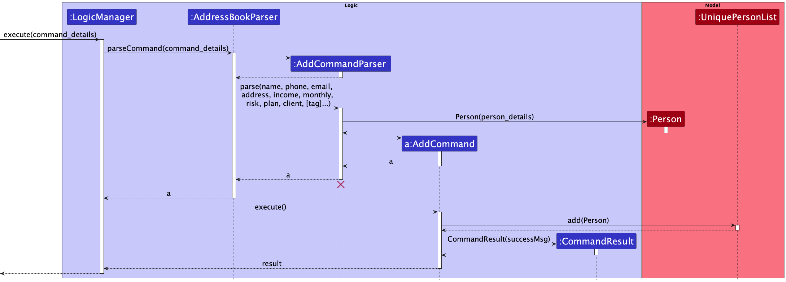
 
*Figure 12: Sequence Diagram showing the execution of an `add` (Add) command*

#### Edit Command

Step 1. When the user inputs an appropriate command `String` into the `CommandBox`, `LogicManager::execute(commandText)` is called. The command `String` is logged and then passed to `AddressBookParser::parseCommand(userInput)` which parses the command.

Step 2. If the user input matches the format for the command word for the `EditCommand`, `AddressBookParser` will create an `EditCommandParser` and will call the `EditCommandParser::parse(args)` to parse the command.

Step 3. Validation for the user input is performed, such as validating the client's `Index`.

Step 4. Validation for the user's input for the format of input such as `Phone` and `Monthly` is also performed to create a `EditPersonDescriptor`

Step 5. If the user input is valid, a new `EditCommand` object is created and returned to the `LogicManager`.

Step 6. `LogicManager` will call `EditCommand::execute(model)` method. `EditPersonDescriptor` will create the edited `Person`

Step 7. Further validation is performed, such as checking whether the user's edited field is changed.

Step 6. If the command is valid, the `remove` and `add` method of the `UniquePersonList` is called,
removing the old Person and adding the newly edited Person. `Model` will be updated accordingly.

Step 7. `EditCommand` will create a `CommandResult` object and will return this created object back to `LogicManager`.

This is shown in the diagram below:
 
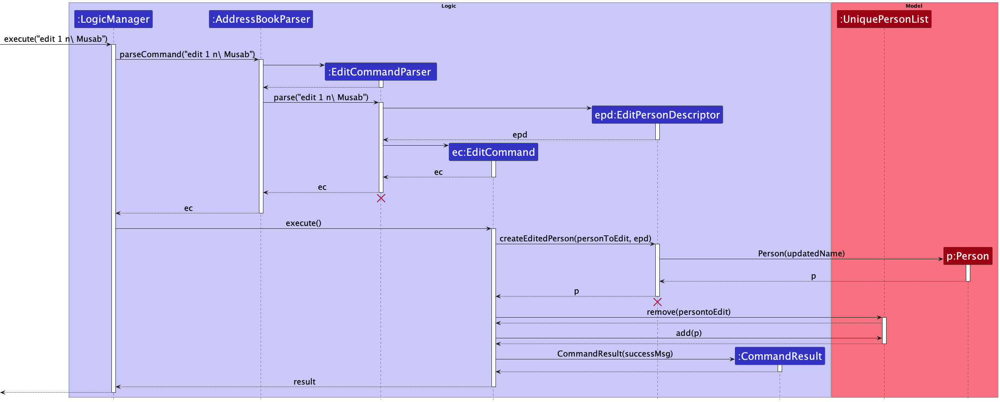
 
*Figure 13: Sequence Diagram showing the execution of an `edit` (Edit) command for name*

#### Delete Command

Step 1. When the user inputs an appropriate command `String` into the `CommandBox`, `LogicManager::execute(commandText)` is called. The command `String` is logged and then passed to `AddressBookParser::parseCommand(userInput)` which parses the command.

Step 2. If the user input matches the format for the command word for the `DeleteCommand`, `AddressBookParser` will create an `DeleteCommandParser` and will call the `DeleteCommandParser::parse(args)` to parse the command.

Step 3. Validation for the user input is performed, such as validating the client's `Index` .

Step 4. If the user input is valid, a new `DeleteCommand` object is created and returned to the `LogicManager`.

Step 5. `LogicManager` will call `DeleteCommand::execute(model)` method. Further validation is performed, such as checking whether an `Appointment` exists to be deleted.

Step 6. If the command is valid, the `remove` method of the `UniquePersonList` is called, which will update the `Model`.

Step 7. `DeleteCommand` will create a `CommandResult` object and will return this created object back to `LogicManager`.

This is shown in the diagram below:
 

 
*Figure 14: Sequence Diagram showing the execution of an `d 1` (Delete Appointment) command*

### Special Tag feature
This feature allows users to record key information about clients as special tag, which are colour coded to make it easier to interpret at a glance. 

Overview of implementation of Special Tags:
* `Tag` - Tag has now been reformatted to an abstract class to support extensions and operations by the new `Tag` classes.
* `NormalTag` - NormalTag now represents the former `Tag` class, which is used to create regular tags which users can create with a single word up to 50 characters. It is also now restricted to maximum of 5 tags per use. The design decision will be elaborated on in later sections.
* `SpecialTag` This is an abstract class that extends `Tag`, which supports `RiskTag`, `ClientTag`, and `PlanTag`.
* `RiskTag` - This is a class for users to indicate client's risk appetite. It accepts only 3 inputs - Low, Medium, and High which are colour coded as GREEN, YELLOW and RED respectively.
* `ClientTag` - This is a class for users to indicate client's status. It accepts only 2 inputs - Potential or Current, which are colour coded as BLUE and GREY.
* `PlanTag` - This is a class for users to indicate client's current financial plan. It accepts any input ending with Plan. It is colour coded in MAGENTA.

Currently, to add any tags including `NormalTag`, users have to use the add or edit commands, which have been enhanced to incorporate the new tags. `SpecialTags` are mandatory while `Tags` are optional

Here are the Prefix to be used with add and edit commands:
1. `NormalTag` - /t
2. `RiskTag` - /r
3. `ClientTag` - /c
4. `PlanTag` - /ip

#### Design Considerations
**Aspect: How many `Tags` can be added for each command**
* **Alternative 1:** Add only one `Tag` in each command.
    * Pros: Simpler input validation and length of user input is shorter, as the presence of other fields has the potential to be very lengthy.
    * Cons: User has to execute the `edit` command multiple times to add all their desired `Tags`.
* **Alternative 2 (current choice)**: Multiple `Tags` can be added in each command
    * Pros: Lower number of commands needed to be executed to add all the desired `Tags`
    * Cons: Lengthier user input, tags have to be re-entered everytime when editing even if it is already present.
    * Rationale: We decided on allowing multiple tags as the users are unlikely to edit tags frequently, hence it would be more user friendly for users to enter fewer commands.

**Aspect: Should special tags be made Mandatory?**
* **Alternative 1 (current choice):** Make all `SpecialTags` mandatory.
    * Pros: Consistent display across all clients, easy for users to find information at a glance.
    * Cons: Users may not have all information ready for all `SpecialTags` when adding new Client.
    * Rationale: Most of the `SpecialTags` pertain to information that users can obtain from their client within the first meeting or contact. Hence we chose to prioritise a consistent display.
* **Alternative 2 (current choice):** Make all `SpecialTags` optional.
  * Pros: Users do not need to enter fields that they do not have the information for.
  * Cons: Inconsistent display across all clients, making it harder for users to find information at a glance.

**Aspect: How many `Tags` can be added for each client**
* **Alternative 1 (current choice):** Limit number of `Tags` per client and character length of each `Tag`.
    * Pros: Ensure consistent display across all clients and prevent excessive `Tag` spam, which may obscure other information.
    * Cons: Users will be restricted to a limited number of `Tags` and they may not be able to add `Tags` of the length they desire.
    * Rationale: The main purpose of the app is to store the key information of clients, which are stored in the main fields and appointment list. Hence, to protect the view of these information, we have decided to limit the `Tag` feature. Additionally, the second longest word in the English Language is 47 characters. Hence, a limit of 50 characters is sufficient for each tag.
* **Alternative 2 :** Do not limit number of `Tags` per client and character length of each `Tag`.
    * Pros: Users will be able to add any `Tags` they desire. 
    * Cons: Display across various clients may be inconsistent, and certain information may be obscured when too many tags are added.
  

### Appointment feature

This feature represents an appointment between a user and a client. An appointment consists of a DateTime and a Location.

Overview of implementation for Appointment:

* `Appointment`- This is a class that stores information regarding an appointment of a specific client, such as the `DateTime` and `Location`.
* `DateTime`- This is a class that stores the Date and Time of an `Appointment`. It has a format of `dd-MM-yyyy HH:mm` as a `String`.
* `Location`- This is a class that stores the location of an `Appointment`. It can take any `String` values, but it must not be blank.
* `JsonAdaptedAppointment`- This is a class that acts as a bridge between the `Appointment` class and `Storage` layer. It specifies how an `Appointment` object is converted to a JSON and vice versa.
* `AddAppointmentCommandParser`- This is a class that parses user input from a `String` to an `AddAppointmentCommand` object. Validation for the user's input is performed in this class.
* `AddAppointmentCommand`- This is a class where the logic for the Add Appointment command is specified and the `execute` method is called. It will access the `Model` layer to ensure that there will not be a duplicate `Appointment` and the maximum number of `Appointments` for the client has not been reached, followed by adding the `Appointment` to the `Model`.
* `MaximumSortedList`- This is an abstraction that represents the list of `Appointments` for a specific client. It ensures that the `Appointments` are in sorted order according to chronological order, ensures that there is a maximum number, 3, of `Appointments` for each client and ensures that there are no duplicate `Appointments` for each client.
* `EditAppointmentCommandParser`- This is a class that parses user input from a `String` to an `EditAppointmentCommand` object. Validation for the user's input is performed in this class.
* `EditAppointmentCommand`- This is a class where the logic for the Edit Appointment command is specified and the `execute` method is called. It will access the `Model` layer to ensure that there will not be a `Appointment` with the same DateTime.
It will then remove the old appointment and add the newly edited appointment. The `Model` will be updated accordingly.
* `EditAppointmentDescriptor`- This is a class that takes in the user input's edited Location/Datetime fields to create the newly edited appointment.
* `DeleteAppointmentCommandParser`- This is a class that parses user input from a `String` to an `DeleteAppointmentCommand` object. Validation for the user's input is performed in this class.
* `DeleteAppointmentCommand`- This is a class where the logic for the Delete Appointment command is specified and the `execute` method is called. It will access the `Model` layer to ensure that there exists an `Appointment` at the specified appointment index. The appointment will be removed from the `Model`.

Currently, the appointment feature supports 3 different type of command:
1. `add appointment`
2. `edit appointment`
3. `delete appointment`

#### Add Appointment Command

Step 1. When the user inputs an appropriate command `String` into the `CommandBox`, `LogicManager::execute(commandText)` is called. The command `String` is logged and then passed to `AddressBookParser::parseCommand(userInput)` which parses the command.
 
For example, the user inputs this command: `"aa 1 d/15-02-2022 12:00 l/NUS"`.
 
The initial state of the `MaximumSortedList<Appointment>` object present in the specified client `Person` object before executing the command is shown below (assuming the client currently has 0 appointments scheduled):
  
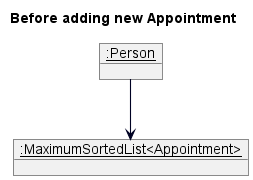
  

Step 2. If the user input matches the format for the command word for the `AddAppointmentCommand`, `AddressBookParser` will create an `AddAppointmentCommandParser` and will call the `AddAppointmentCommandParser::parse(args)` to parse the command.

Step 3. Validation for the user input is performed, such as validating the client's `Index`, the format of the `DateTime` and `Location`.

Step 4. If the user input is valid, a new `AddAppointmentCommand` object is created and returned to the `LogicManager`.

Step 5. `LogicManager` will call `AddAppointmentCommand::execute(model)` method. Further validation is performed, such as checking whether a duplicate `Appointment` exists and whether the user has already scheduled the maximum number, 3, of `Appointments` for the specified client.

Step 6. If the command is valid, the `add` method of the `MaximumSortedList` containing the client's `Appointments` is called, which will update the `Person` and `Model`.
The `MaximumSortedList<Appointment>` object present in the specified client `Person` will be updated as shown below:
  
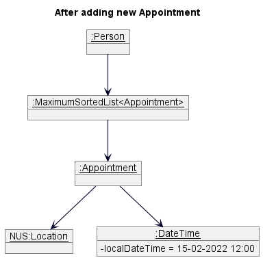
  

Step 7. `AddAppointmentCommand` will create a `CommandResult` object and will return this created object back to `LogicManager`.

This is shown in the diagram below:

:information_source: **Note:** command_details and command_values refer to the command `aa 1 d/15-02-2022 12:00 l/NUS` and the command values `1 d/15-02-2022 12:00 l/NUS`. We have substituted these values for readability.

*Figure 15: Sequence Diagram showing the execution of an `aa` (Add Appointment) command*

#### Design Considerations
**Aspect: How many `Appointments` can be added for each command**
* **Alternative 1 (current choice):** Add only one `Appointment` in each command.
  * Pros: Simpler input validation and length of user input is shorter, as the presence of multiple `DateTime` and `Location` fields has the potential to be very lengthy
  * Cons: User has to execute the `aa` command multiple times to add all their desired `Appointments`
* **Alternative 2**: Multiple `Appointments` can be added in each command
  * Pros: Lower number of commands needed to be executed to add all the desired `Appointments`
  * Cons: Complex input validation as unique `DateTimes` and `Locations` must be enforced within the command and alongside the existing `Appointments`. The maximum number of `Appointments` must also be enforced. Also, length of user input may be very long

#### Edit Appointment Command

Step 1. When the user inputs an appropriate command `String` into the `CommandBox`, `LogicManager::execute(commandText)` is called. The command `String` is logged and then passed to `AddressBookParser::parseCommand(userInput)` which parses the command.
 
For example, the user inputs this command: `"ea 1.1 l/NUS"`.
 
The initial state of the `MaximumSortedList<Appointment>` object present in the specified client `Person` object before executing the command is shown below (assuming the client currently has 1 appointment scheduled):
  
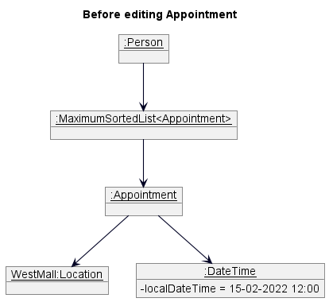
  
Step 2. If the user input matches the format for the command word for the `EditAppointmentCommand`, `AddressBookParser` will create an `EditAppointmentCommandParser` and will call the `EditAppointmentCommandParser::parse(args)` to parse the command.

Step 3. Validation for the user input is performed, such as validating the client's `Index` and the appointment's `Index`

Step 4. Validation for the user's input for the format of the `DateTime` and `Location` is also performed to create a `EditAppointmentDescriptor`

Step 5. If the user input is valid, a new `EditAppointmentCommand` object is created and returned to the `LogicManager`.

Step 6. `LogicManager` will call `EditAppointmentCommand::execute(model)` method. `EditAppointmentDescriptor` will create the edited `Appointment`

Step 7. Further validation is performed, such as checking whether an `Appointment` with the same Datetime exists and whether the user's edited Location field is changed.

Step 6. If the command is valid, the `remove` and `add` method of the `MaximumSortedList` containing the client's `Appointments` is called,
removing the old appointment and adding the newly edited appointment. `Person` and `Model` will be updated accordingly.
The `MaximumSortedList<Appointment>` object present in the specified client `Person` will be updated as shown below:
  
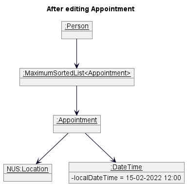
  
Step 7. `EditAppointmentCommand` will create a `CommandResult` object and will return this created object back to `LogicManager`.

This is shown in the diagram below:
 
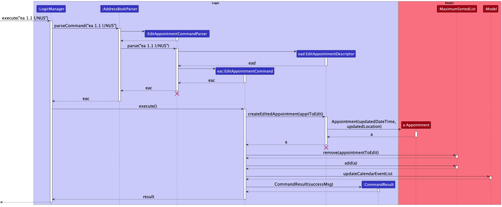
 
*Figure 16: Sequence Diagram showing the execution of an `ea` (Edit Appointment) command*

#### Design Considerations
**Aspect: How many `Appointments` can be edited for each command?**
* **Alternative 1 (current choice):** Edit only one `Appointment` in each command.
    * Pros: Simpler input validation and length of user input is shorter.
    * Cons: User has to execute the `ea` command multiple times to edit all their desired `Appointments`
* **Alternative 2**: Multiple `Appointments` can be edited in each command
    * Pros: Lower number of commands needed to be executed to edit all the desired `Appointments`
    * Cons: Complex input validation as multiple index must be enforced within the command and alongside the existing `Appointments`. The maximum number of `Appointments` to edit must also be enforced.

#### Delete Appointment Command

Step 1. When the user inputs an appropriate command `String` into the `CommandBox`, `LogicManager::execute(commandText)` is called. The command `String` is logged and then passed to `AddressBookParser::parseCommand(userInput)` which parses the command.
For example, the user inputs this command: `da 1.1`.
 
The initial state of the `MaximumSortedList<Appointment>` object present in the specified client Person object before executing the command is shown below (assuming the client currently has 1 appointment scheduled):
  
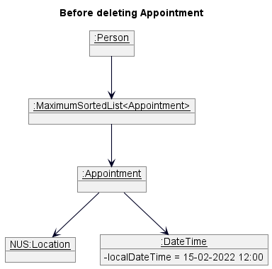
  
Step 2. If the user input matches the format for the command word for the `DeleteAppointmentCommand`, `AddressBookParser` will create an `DeleteAppointmentCommandParser` and will call the `DeleteAppointmentCommandParser::parse(args)` to parse the command.

Step 3. Validation for the user input is performed, such as validating the client's `Index` and the appointment's `Index`.

Step 4. If the user input is valid, a new `DeleteAppointmentCommand` object is created and returned to the `LogicManager`.

Step 5. `LogicManager` will call `DeleteAppointmentCommand::execute(model)` method. Further validation is performed, such as checking whether an `Appointment` exists to be deleted.

Step 6. If the command is valid, the `remove` method of the `MaximumSortedList` containing the client's `Appointments` is called, which will update the `Person` and `Model`.
The `MaximumSortedList<Appointment>` object present in the specified client `Person` will be updated as shown below:
  
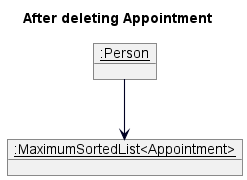
  
Step 7. `DeleteAppointmentCommand` will create a `CommandResult` object and will return this created object back to `LogicManager`.

This is shown in the diagram below:
 

 
*Figure 17: Sequence Diagram showing the execution of an `da` (Delete Appointment) command*

#### Design Considerations
**Aspect: How many `Appointments` can be deleted for each command**
* **Alternative 1 (current choice):** Delete only one `Appointment` in each command.
    * Pros: Simpler input validation and length of user input is shorter.
    * Cons: User has to execute the `da` command multiple times to delete all their desired `Appointments`
* **Alternative 2**: Multiple `Appointments` can be deleted in each command
    * Pros: Lower number of commands needed to be executed to delete all the desired `Appointments`
    * Cons: Complex input validation as multiple index must be enforced within the command and alongside the existing `Appointments`. The maximum number of `Appointments` to delete must also be enforced.

### Sort feature

The `sort` command allows the user to sort the clients by a keyword input by the user.

Overview of implementation for `sort` command:

Current implementation

The sort function is facilitated by the java inbuilt Collections::sort method. This is implemented by creating a custom comparator that implements the Comparator Interface, and passing it into the sort method. There are currently six custom comparators implemented:
* `SortByName` - Sorts the contacts by alphabetical order
* `SortByAppointment` - Sorts the contacts by date and time
* `SortByIncome` - Sorts the contacts by specified order (<, > or =)
* `SortByMonthly` - Sorts the contacts by specified order (<, > or =)
* `SortByRisktag` - Sorts the contacts from low to high risk or high to low risk
* `SortByClientTag` - Sorts the clients based on current or potential

`SortByName`: Implemented by using Java inbuilt String::compareTo.
`SortByAppointment`: Implemented by first converting appointment to DateTime and using our overriden Appointment::compareTo.
`SortByIncome`: Implemented by first converting income to long and using normal > and < symbols to sort.
`SortByMonthly`: Implemented by first converting monthly to long and substracting the two values.
`SortByClientTag`: Implemented by assigning each type of client tag a number, and subtracting them to sort.
`SortByRiskTag`: Implemented by assigning each type of risk tag a number, and subtracting them to sort.

#### Sort Command

Step 1. When the user inputs an appropriate command `String` into the `CommandBox`, `LogicManager::execute(commandText)` is called. The command `String` is logged and then passed to `AddressBookParser::parseCommand(userInput)` which parses the command.

Step 2. If the user input matches the format for the command word for the `SortCommand`, `AddressBookParse` will create a `SortCommandParser` and will call the `SortCommandParser::parse(args)` to parse the command.

Step 3. Validation for the user input is performed, such as validating that the keyword the user input is in the correct format.

Step 4. In the example shown below, the keyword the user input is `income`. If the user input is valid, a new `SortByIncome` comparator object is created and  return a `SortCommand` object with that comparator.

Step 5. After the execution of this, `LogicManager` calls `SortCommand::execute(model)` where model contains methods that modify the state of our contacts.

Step 6. After a series of method executions, it calls `UniquePersonList::sortPersons(SortByIncome)`, which executes the sort method to sort the list of contacts by their income.

This is shown in the diagram below:

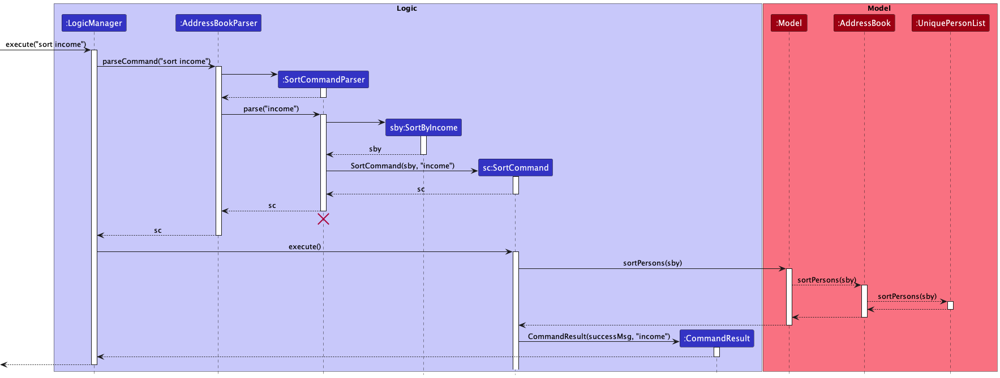

*Figure 18: Sequence Diagram showing the execution of an `sort` command*

The following activity diagram summarizes what happens when a user executes the Sort Command:

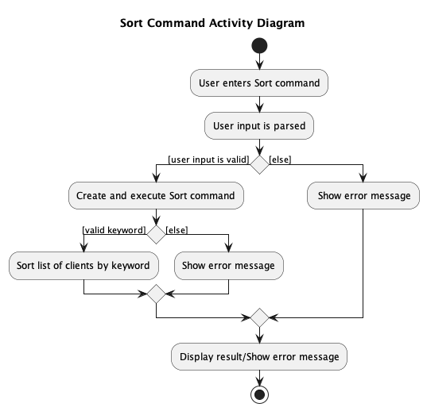

*Figure 19: Activity Diagram showing the execution of an `sort` command*

#### Design Considerations

**Aspect: How `sort` executes**
* **Alternative 1 (current choice):** Use Java inbuilt `Collections::sort`.
    * Pros: Easy to implement as not much modification needed.
    * Cons: May require the addition of attributes to implement the `compareTo` method.
* **Alternative 2**: Implement a custom Sort method.
    * Pros: May not need additional attributes to implement the `compareTo` method.
    * Cons: Longer sort time, likely not to be as efficient as the inbuilt `Collections::sort`.

**Aspect: How `SortByAppointment` is executed**
* **Alternative 1 (current choice):** Convert the appointment to DateTime and using our overriden `Appointment::compareTo`.
    * Pros: Easy to implement as not much modification needed.
    * Cons: Need to account for a few cases of empty appointments in `SortByAppointment::compareTo`.
* **Alternative 2**: Compare the appointment dates in String.
    * Pros: No need to convert the values to another type.
    * Cons: Hard to implement as there are many different comparisons that can be made, like year, date, time and month.

### Find feature

The `find` command allows the user to search for multiple fields at once. An OR search is performed and clients matching at least one keyword will be returned.

Overview of implementation for `find` command:

Currently, the `FindCommandParser` class parses the different prefixes and their values and creates the corresponding `FindPredicate` (e.g the Name prefix will create a `NameContainsKeywordsPredicate` and the Income prefix will create an `IncomeContainsKeywordsPredicate`). These predicates are stored in a list, and are then passed as an argument to the `FindCommand`. The `FindCommand` updates the list of filtered `Persons`.

There are currently 8 custom predicates that inherits `FindPredicate` implemented:
* `NameContainsKeywordsPredicate` - checks if the person's name matches the keyword input by the user.
* `NormalTagContainsKeywordsPredicate` - checks if the person's tags matches the keyword input by the user.
* `PhoneContainsKeywordsPredicate` - checks if the person's phone number matches the keyword input by the user.
* `PlanTagContainsKeywordsPredicate` - checks if the person's investment plan matches the keyword input by the user.
* `RiskTagContainsKeywordsPredicate` - checks if the person's risk tag matches the keyword input by the user.
* `IncomeContainsKeywordsPredicate` - checks if the person's income matches the criteria input by the user.
* `ClientTagContainsKeywordsPredicate` - checks if the person's client tag matches the keyword input by the user.
* `MonthlyContainsKeywordsPredicate` - checks if the person's monthly contribution matches the keyword input by the user.

Given below is an example success scenario and how the find mechanism behaves at each step.

1. The user executes `find`.
2. `LogicManager` calls `AddressBookParser#parseCommand(userInput)`.
3. `AddressBookParser` calls `FindCommandParser#parse(userInput)`.
4. `FindCommandParser` parses the arguments and converts all the prefixes and their values to a list of predicates.
5. `LogicManager` calls `FindCommand#execute(model, storage)`.
6. `FindCommand` calls `Model#updateFilteredPersonList(predicates)`.
7. `FindCommand` updates the `filteredPersons` in `model` and only clients that match any of the keywords are shown.

The following activity diagram summarizes what happens when a user executes the Find command:

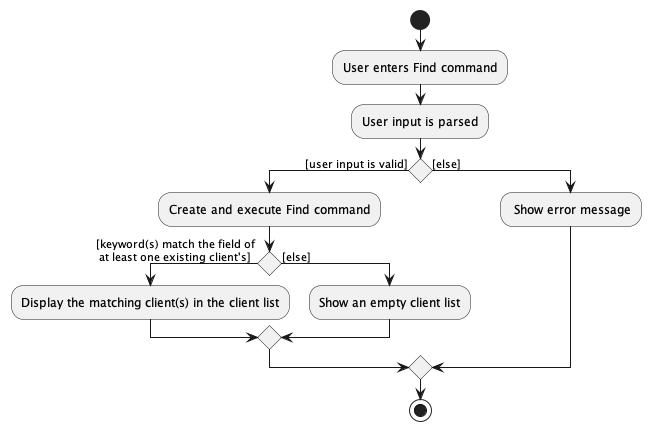

*Figure 20: Activity Diagram showing the execution of an `find` command*

#### Design Considerations

**Aspect: Format of the `find` command**
* **Alternative 1 (current choice):** Use prefixes to search for specific fields
    * Pros: Simpler input validation and search time is shorter, as the search is only conducted for the input fields.
    * Cons: User may have to type a longer command to match the specific fields and values they require during search.
* **Alternative 2**: Input keywords will be searched for every field
    * Pros: Shorter command input, as only the required keywords are inputted.
    * Cons: Longer search time for each individual command and more complex validation is required, as keywords may be different types like `String` or `Integer`.

### Parameter hint (enhancement)
This enhancement allows a user to view the correct prefixes and arguments of a command before entering the command.

The parameter hints for the command will be shown in the ResultDisplay once the command word is typed out.

Implementation:
1. `CommandBox` takes in the `ResultDisplay` as one of the arguments for its constructor method
2. In the `CommandBox` constructor method, `setupCommandHistoryNavigation()` is called which sets up `commandTextField`
   to listen for the event when a valid command word is typed
3. When the event occurs, `ResultDisplay#setFeedbackToUser()` is called to display the command's message usage in the `ResultDisplay`

### Command History feature
This feature allows the user to navigate to their previously entered commands using up/down arrow keys
- Only valid commands will be saved in the command history
- Command history will only save up to 20 previously typed valid commands
- Consecutive duplicate commands will not be saved (e.g entering “list” 3 times in a row will only add “list” to command history once)

`CommandHistory` has an index pointer which tracks where the user is currently at in the command history list
and also manages the writing and reading of commands to and from the command history list.

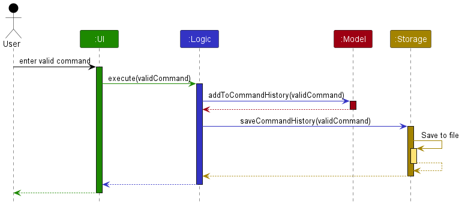

*Figure 21: Sequence Diagram showing how a valid command is saved in TextCommandHistoryStorage*
  

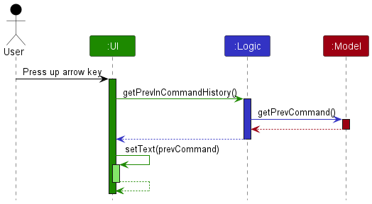

*Figure 22: Sequence Diagram showing how an up arrow key navigates to the previous command*

### Calendar features
The calendar feature allows a calendar to display with the corresponding appointments of the month in a calendar format. The feature consists of the following features:

* `Calendar Display` — Can display appointments of a month in a calendar format.
* `Calendar Navigation` — Can navigate between months with/without a mouse.
* `Calendar Pop-Up` — Can view the details of each appointment.

#### Overall implementation of Calendar

The main calendar display is implemented using the `CalendarDisplay` class, which acts as the main container for the entire Calendar feature. This main container consists of a `TopCalendar`, which is a `FlowPane` that contains the current month to be displayed, and the different navigation buttons as well as the `JumpBox`. Also, `CalendarDisplay` contains `CalendarGrid`, which is a GridPane that contains all the dates and `Appointment` buttons within the calendar.

Upon initialisation of the `CalendarDisplay`, it will display the current month and year, using the `CalendarLogic#drawCalendar()` method. The current month and year is obtained using the default `Java` package's `GregorianCalendar` class.

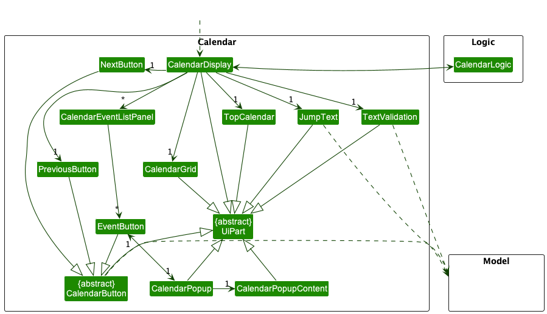

*Figure 23. Class diagram showing the classes for the Calendar in the `Ui`*

**Calendar Display**

Implementation:

The following is a more detailed explanation on how `Calendar Display` is implemented:
1. When the app first launches, `MainWindow#fillInnerParts()` is called, which then initialises the `Calendar Display`.
2. The `CalendarLogic` class is initialised, where the current month to be displayed in the Calendar is set using `Java`'s `GregorianCalendar` class. 
3. Next, `CalendarLogic#drawCalendar()` is called which initialises the header of the Calendar, by calling `CalendarLogic#drawHeader()`, where the `FlowPane`, `TopCalendar`, displays the current month.
4. Also, `CalendarLogic#drawCalendar()` will then call `CalendarLogic#drawBody()` which initialise the body of the Calendar and each individual day of the month is created in the Calendar.
5. A `CalendarEventListPanel` object is created for each day of the month, and `EventButtons` are added to each `CalendarEventListPanel` if there is an appointment falling on that particular day.
6. Following which, when appointments are added,`Model#updateCalendarEventList()` is called which then updates the `Calendar Display` as well.

*Figure 24. Activity diagram showing what happens when a user selects the Calendar tab*

**Calendar Navigation**

The Calendar navigation allows a user to navigate between different months in the calendar and also navigate between the different appointments within the current month.
This feature uses JavaFX's [`FocusModel`](https://docs.oracle.com/javase/8/javafx/api/javafx/scene/control/FocusModel.html) features to obtain different behaviours when a UI component is focused.
Also, JavaFX's [`KeyEvent`](https://docs.oracle.com/javase/8/javafx/api/javafx/scene/input/KeyEvent.html) feature is used to listen to the different keystrokes that will update our UI.

These are the ways that a user can use the `Calendar Navigation` feature.
1. Clicking on the Next/Prev buttons to view the next/previous month in the calendar
2. Pressing N or B key to view the next/previous month in the calendar
3. Typing the date in the Jump Box and pressing the ENTER key to view the input month and year of the date.

*Figure 25. Activity diagram showing what happens  when a user selects a navigation feature*

#### Calendar Pop-up
The calendar Pop-up allows user to view the details of the appointment in the calendar

Implementation:

These are the ways that a user can use the `Calendar Pop-up` feature.
1. Clicking on the Up/Down/Left/Right keys to view adjacent appointments oriented in space in the calendar
2. Pressing SHIFT or SHIFT + TAB key to view the next/previous appointment in the calendar
3. Clicking on a desired appointment to view the appointment in the calendar

*Figure 26. Activity diagram showing what happens  when a user selects an appointment in the calendar tab*

### \[Proposed\] Undo/redo feature

#### Proposed future Implementation

The proposed undo/redo mechanism is facilitated by `VersionedAddressBook`. It extends `AddressBook` with an undo/redo history, stored internally as an `addressBookStateList` and `currentStatePointer`. Additionally, it implements the following operations:

* `VersionedAddressBook#commit()` — Saves the current address book state in its history.
* `VersionedAddressBook#undo()` — Restores the previous address book state from its history.
* `VersionedAddressBook#redo()` — Restores a previously undone address book state from its history.

These operations are exposed in the `Model` interface as `Model#commitAddressBook()`, `Model#undoAddressBook()` and `Model#redoAddressBook()` respectively.

Given below is an example usage scenario and how the undo/redo mechanism behaves at each step.

Step 1. The user launches the application for the first time. The `VersionedAddressBook` will be initialized with the initial address book state, and the `currentStatePointer` pointing to that single address book state.

Step 2. The user executes `delete 5` command to delete the 5th person in the address book. The `delete` command calls `Model#commitAddressBook()`, causing the modified state of the address book after the `delete 5` command executes to be saved in the `addressBookStateList`, and the `currentStatePointer` is shifted to the newly inserted address book state.

Step 3. The user executes `add n/David …​` to add a new person. The `add` command also calls `Model#commitAddressBook()`, causing another modified address book state to be saved into the `addressBookStateList`.

:information_source: **Note:** If a command fails its execution, it will not call `Model#commitAddressBook()`, so the address book state will not be saved into the `addressBookStateList`.

Step 4. The user now decides that adding the person was a mistake, and decides to undo that action by executing the `undo` command. The `undo` command will call `Model#undoAddressBook()`, which will shift the `currentStatePointer` once to the left, pointing it to the previous address book state, and restores the address book to that state.

:information_source: **Note:** If the `currentStatePointer` is at index 0, pointing to the initial AddressBook state, then there are no previous AddressBook states to restore. The `undo` command uses `Model#canUndoAddressBook()` to check if this is the case. If so, it will return an error to the user rather
than attempting to perform the undo.

The following sequence diagram shows how the undo operation works:

:information_source: **Note:** The lifeline for `UndoCommand` should end at the destroy marker (X) but due to a limitation of PlantUML, the lifeline reaches the end of diagram.

The `redo` command does the opposite — it calls `Model#redoAddressBook()`, which shifts the `currentStatePointer` once to the right, pointing to the previously undone state, and restores the address book to that state.

:information_source: **Note:** If the `currentStatePointer` is at index `addressBookStateList.size() - 1`, pointing to the latest address book state, then there are no undone AddressBook states to restore. The `redo` command uses `Model#canRedoAddressBook()` to check if this is the case. If so, it will return an error to the user rather than attempting to perform the redo.

Step 5. The user then decides to execute the command `list`. Commands that do not modify the address book, such as `list`, will usually not call `Model#commitAddressBook()`, `Model#undoAddressBook()` or `Model#redoAddressBook()`. Thus, the `addressBookStateList` remains unchanged.

Step 6. The user executes `clear`, which calls `Model#commitAddressBook()`. Since the `currentStatePointer` is not pointing at the end of the `addressBookStateList`, all address book states after the `currentStatePointer` will be purged. Reason: It no longer makes sense to redo the `add n/David …​` command. This is the behavior that most modern desktop applications follow.

The following activity diagram summarizes what happens when a user executes a new command:

#### Design considerations:

**Aspect: How undo & redo executes:**

* **Alternative 1 (current choice):** Saves the entire address book.
  * Pros: Easy to implement.
  * Cons: May have performance issues in terms of memory usage.

* **Alternative 2:** Individual command knows how to undo/redo by
  itself.
  * Pros: Will use less memory (e.g. for `delete`, just save the person being deleted).
  * Cons: We must ensure that the implementation of each individual command are correct.

_{more aspects and alternatives to be added}_

--------------------------------------------------------------------------------------------------------------------

## **Documentation, logging, testing, configuration, dev-ops**

* [Documentation guide](Documentation.md)
* [Testing guide](Testing.md)
* [Logging guide](Logging.md)
* [Configuration guide](Configuration.md)
* [DevOps guide](DevOps.md)

--------------------------------------------------------------------------------------------------------------------

## **Appendix: Requirements**

### Product scope

**Target user profile**:

* has a need to manage a significant number of clients
* prefer desktop apps over other types
* can type fast
* prefers typing to mouse interactions
* is reasonably comfortable using CLI apps
* requires a secure app to store sensitive client details

**Value proposition**: manage contacts faster than a typical mouse/GUI driven app while ensuring that client details are safe and secure.

### User stories

Priorities: High (must have) - `* * *`, Medium (nice to have) - `* *`, Low (unlikely to have) - `*`

| Priority  | As a …​           | I want to …​                                                           | So that I can…​                                                                            |
|-----------|-------------------|------------------------------------------------------------------------|--------------------------------------------------------------------------------------------|
| `* * *`   | financial advisor | add new client                                                         | keep track of the client's profile                                                         |
| `* * *`   | financial advisor | delete a client                                                        | remove entries that are no longer needed                                                   |
| `* * *`   | new user          | learn how to use the app                                               | can effectively use the app                                                                |
| `* * *`   | financial advisor | edit a client's profile                                                | update relevant and up-to-date information of the client                                   |
| `* * *`   | financial advisor | search clients by name                                                 | retrieve information of clients without having to go through the entire list               |
| `* * *`   | financial advisor | search clients by their investment plan                                | can easily find a group of clients                                                         |
| `* * *`   | financial advisor | search clients based on whether they are potential or current          | can easily find a group of clients                                                         |
| `* * *`   | financial advisor | search clients based on their risk appetite                            | can easily find a group of clients                                                         |
| `* * *`   | financial advisor | sort clients by alphabetical order                                     | have an organised list of contacts                                                         |
| `* * *`   | financial advisor | sort clients by their income                                           | have an organised list of contacts                                                         |
| `* * *`   | financial advisor | store important information of clients                                 | make pivotal decisions on how to better suit the clients' needs based on their information |
| `* * *`   | financial advisor | store upcoming appointments for each client                            | keep track of all my upcoming appointments                                                 |
| `* * *`   | financial advisor | edit my current appointments for each client                           | update my appointment details, if any changes has been made                                |
| `* * *`   | financial advisor | delete an appointment                                                  | remove any completed or cancelled appointments in my list of appointments                  |
| `* * *`   | busy person       | quickly view the format of any command                                 | can focus on my daily tasks instead of having to remember the command syntax               |
| `* * `    | financial advisor | view the list of clients that are scheduled for meeting on a given day | be reminded and keep track of the scheduled meetings                                       |
| `* *`     | financial advisor | have an image of my client                                             | remember and recognise the clients during the meetings                                     |
| `* *`     | fast-typist       | navigate through the calendar with my keyboard                         | view all my appointments in the calendar quickly                                           |
| `* *`     | forgetful person  | view which are the upcoming appointments I have                        | know what to prepare for whom                                                              |
| `* *`     | potential user    | see how the app operates with some sample data                         | understand what the app will look like when I actually use it                              |
| `*`       | financial advisor | view frequently searched clients                                       | do not need to keep searching for the same person constantly                               |
| `*`       | financial advisor | transferring of data between devices                                   | can switch between devices easily and integrate the data easily                            |

### Use cases

(For all use cases below, the **System** is the `Financial Advisor Planner` and the **Actor** is the `user`, unless specified otherwise)

**Use case: UC1 - Add a client**

**MSS**

1.  User inputs add command with the client's information
2.  Financial Advisor Planner adds the client and their information to the list

    Use case ends.

**Extensions**

* 1a. Input fields are invalid

  * 1a1. Financial Advisor Planner shows an error message.

    Use case ends.
* 1b. Any of the mandatory fields are not input by the user

    * 1b1. Financial Advisor Planner shows an error message.

      Use case ends.

**Use case: UC2 - Delete a client**

**MSS**

1.  User requests to list clients
2.  Financial Advisor Planner shows a list of clients
3.  User requests to delete a specific client in the list
4.  Financial Advisor Planner deletes the client

    Use case ends.

**Extensions**

* 2a. The list is empty.

  Use case ends.

* 3a. The given index is invalid.

    * 3a1. Financial Advisor Planner shows an error message.

      Use case resumes at step 2.

**Use case: UC3 - Edit client details**

**MSS**

1. User requests to list clients
2. Financial Advisor Planner shows a list of clients
3. User requests to edit the details of a client at the specified index
4. Financial Advisor Planner edits the details of the specified client in the list

    Use case ends.

**Extensions**

* 3a. User did not input any arguments.

    * 3a1. Financial Advisor Planner shows an error message.

      Use case resumes at step 2.

* 3b. The given index is invalid.

    * 3b1. Financial Advisor Planner shows an error message.

      Use case resumes at step 2.

**Use case: UC4 - Clear Financial Advisor Planner**

**MSS**

1.  User requests to clear the list of clients
2.  Financial Advisor Planner shows a success message

    Use case ends.

**Use case: UC5 - Find client**

**MSS**

1. User requests to find clients containing input keyword(s)
2. Financial Advisor Planner shows a list of clients with the matching keyword(s)

    Use case ends.

   **Extensions**

* 1a. User did not input any arguments.

    * 1a1. Financial Advisor Planner shows an error message.

      Use case ends.

* 1b. The given prefix is invalid.

    * 1b1. Financial Advisor Planner shows an error message.

      Use case ends.

* 1c. The given keyword is invalid

    * 1c1. Financial Advisor Planner shows an error message.

      Use case ends.

* 1d. User did not input any keywords

    * 1d1. Financial Advisor Planner shows an error message.

      Use case ends.

**Use case: UC6 - Add an appointment**

**MSS**

1. User inputs add appointment command with the appointment details for a specific client
2. Financial Advisor Planner adds the appointment to the list of appointments for the specified client

    Use case ends.

   **Extensions**

* 1a. User did not input any arguments.

    * 1a1. Financial Advisor Planner shows an error message.

      Use case ends.

* 1b. The given index is invalid.

    * 1b1. Financial Advisor Planner shows an error message.

      Use case ends.

* 1c. The given date and time has an incorrect format.

    * 1c1. Financial Advisor Planner shows an error message.

      Use case ends.

* 1d. The input appointment already exists for the specified client

    * 1d1. Financial Advisor Planner shows an error message.

      Use case ends.

* 1e. The specified client already has the maximum number of appointments

    * 1e1. Financial Advisor Planner shows an error message.

      Use case ends.

**Use case: UC7 - Edit an appointment**

**MSS**

1. User inputs edit appointment command with the new field/s (location, datetime) for a specific client
2. Financial Advisor Planner edits the appointment for the specified client
3. The client's list of appointments is reordered using the date time of each appointment

   Use case ends.

   **Extensions**

* 1a. User did not input any arguments.

    * 1a1. Financial Advisor Planner shows an error message.

      Use case ends.

* 1b. The given person/appointment index is invalid.

    * 1b1. Financial Advisor Planner shows an error message.

      Use case ends.

* 1c. The given date and time has an incorrect format.

    * 1c1. Financial Advisor Planner shows an error message.

      Use case ends.

* 1d. The given location has an incorrect format

    * 1d1. Financial Advisor Planner shows an error message.

      Use case ends.

* 1e. The newly edited appointment already exists for the specified client

    * 1e1. Financial Advisor Planner shows an error message.

      Use case ends.

**Use case: UC8 - Sort contacts by keywords**

**MSS**

1.  User requests to sort clients by keyword(s)
2.  Financial Advisor Planner shows a list of clients sorted by the matching keyword(s)

    Use case ends.

    **Extensions**

* 1a. User did not input any arguments.

    * 1a1. Financial Advisor Planner shows an error message.

      Use case ends.

* 1b. The given keyword is invalid.

    * 1b1. Financial Advisor Planner shows an error message.

      Use case ends.

* 1c. User did not input any keywords.

    * 1c1. Financial Advisor Planner shows an error message.

      Use case ends.

**Use case: UC9 - Display appointments of the current month in a calendar view**

**MSS**

1. User <ins>add an appointment(UC6)</ins>
2. User requests to view all the appointments in a calendar view of the current month
3. Financial Advisor Planner shows all the appointments in a given month according to their dates

    Use case ends.

    **Extensions**

* 1a. User <ins>find clients with matching keyword(s)(UC5)</ins>

    * 1a1. Financial Advisor Planner shows all the appointments of the current month in a calendar view.

      Use case ends.

**Use case: UC10 - Display appointments of a new month in a calendar view**

**MSS**

1. User requests to view all the appointments of a new month in a calendar view.
2. Financial Advisor Planner shows all the appointments in the new month in a calendar view.

    Use case ends.

    **Extensions**

* 1a. User uses the `Next Button`

    * 1a1. Financial Advisor Planner shows the appointments of the next month in a calendar view.

      Use case ends.
* 1b. User uses the `Prev Button`

    * 1b1. Financial Advisor Planner shows the appointments of the previous month in a calendar view.

      Use case ends.
* 1c. User inputs a valid date in the `Jump Box`

    * 1c1. Financial Advisor Planner shows the appointments of the month of the input date in a calendar view.

      Use case ends.
* 1d. User inputs an invalid date in the `Jump Box`

    * 1d1. Financial Advisor Planner shows an error message.

      Use case ends.

**Use case: UC11 - Find Clients by Risk Tag**

**MSS**

1. User searches for clients by their risk tag.
2. Financial Advisor Planner shows a list of clients that matches the given risk tag.

   Use case ends.

   **Extensions**

* 1a. User inputs an invalid risk tag

    * 1a1. Financial Advisor Planner shows an error message

      Use case ends.
* 1b. Financial Advisor Planner can't find any matching clients given the risk tag

    * 1b1. Financial Advisor Planner shows an empty list

    Use case ends.

**Use case: UC12 - Find Clients by income**

**MSS**

1. User searches for clients by their income.
2. Financial Advisor Planner shows a list of clients that matches the given range of income.

   Use case ends.

   **Extensions**

* 1a. User inputs an invalid income

    * 1a1. Financial Advisor Planner shows an error message

      Use case ends.
* 1b. Financial Advisor Planner can't find any matching clients given the income range

    * 1b1. Financial Advisor Planner shows an empty list

  Use case ends.

### Non-Functional Requirements

1. Should work on any _mainstream OS_ as long as it has Java `11` or above installed.
2. Should be able to hold up to 1000 persons without a noticeable sluggishness in performance for typical usage.
3. A user with above average typing speed for regular English text (i.e. not code, not system admin commands) should be able to accomplish most of the tasks faster using commands than using the mouse.
4. Should execute command within 1 second
5. Should work without an internet connection
6. Should be reliable and bug free
7. Stored data should be backwards compatible with older versions
8. User interface should be usable for beginners
9. Application should be usable by a single user
10. Data should be stored locally and not use any database management system.

### Glossary

* **Mainstream OS**: Windows, Linux, Unix, OS-X
* **Private contact detail**: A contact detail that is not meant to be shared with others
* **CLI**: Command Line Interface
* **GUI**: Graphical User Interface
* **MSS**: Main Success Scenario: Describes the most straightforward interaction for a given use case, which assumes that nothing goes wrong
* **FXML**: FX Markup Language, the format in which the GUI layout is stored in

--------------------------------------------------------------------------------------------------------------------

## **Appendix: Instructions for manual testing**

Given below are instructions to test the app manually.

:information_source: **Note:** These instructions only provide a starting point for testers to work on;
testers are expected to do more *exploratory* testing.

### Launch and shutdown

1. Initial launch

   1. Download the jar file and copy into an empty folder

   1. Double-click the jar file Expected: Shows the GUI with a set of sample contacts. The window size may not be optimum.

1. Saving window preferences

   1. Resize the window to an optimum size. Move the window to a different location. Close the window.

   1. Re-launch the app by double-clicking the jar file. 
       Expected: The most recent window size and location is retained.

1. _{ more test cases …​ }_

### Adding a client
1. Adding a client

2. Prerequisites: Arguments are valid, parameters that are compulsory are provided. Clients added must not be a duplicate client that is already in the contact book.

3. Test case: `add n/John Doe p/98765432 e/johnd@example.com a/311, Clementi Ave 2, #02-25 i/1000 m/200 r/HIGH ip/Savings Plan c/CURRENT t/friends t/owesMoney` 
   Expected: Client is added. Details of the newly added client is shown in the status message.

4. Test case: `add n/John Doe p/98765432 e/johnd@example.com a/311, Clementi Ave 2, #02-25 i/1000 m/200 r/HIGH ip/Savings Plan c/CURRENT` 
   Expected: Client is added. Details of the newly added client is shown in the status message.

5. Test case: `add n/John Doe` 
   Expected: No client is added. Error details will show that there is invalid command format.

6. Test case: `add n/John Doe p/98765432` 
   Expected: No client is added. Error details will show that there is invalid command format.

7. Test case: `add n/John Doe p/98765432 e/johnd@example.com... a/311, Clementi Ave 2, #02-25 i/1000 m/200 r/HIGH ip/Savings Plan c/CURRENT` 
   Expected: No client is added. Error details will show that there is invalid email format.(where ... represents email string that exceeds the character limit of 320)

8Test case: `add n/John Doe p/98765432 e/johnd@example.com a/311, Clementi Ave 2, #02-25 i/1000 m/200 r/HIGH ip/Savings Plan c/CURRENT t/friends...` 
   Expected: No client is added. Error details will show that there is a invalid tag format.(where ... represents tag string that exceeds the character limit of 50)

### Editing a client
1. Editing a client

2. Prerequisites: Arguments are valid, at least one parameter is provided. Client's whose name is being edited must not be a duplicate client that is already in the contact book. At least one client in the list.

3. Test case: `edit 1 p/91234567 e/johndoe@example.com` 
   Expected: Client at index 1 of the displayed list is edited. Details of the newly edited client is shown in the status message.

4. Test case: `edit 1 n/John Doe p/98765432 e/johnd@example.com a/311, Clementi Ave 2, #02-25 i/1000 m/200 r/HIGH ip/Savings Plan c/CURRENT` 
   Expected: Client at index 1 of the displayed list is edited. Details of the newly edited client is shown in the status message.

5. Test case: `edit 1 n/John Doe` 
   Expected: No fields of client is edited. Error details will show that there is no change in fields of the edited client. (where client at index 1 has the name of John Doe)

6. Test case: `edit 1` 
   Expected: No fields of client is edited. Error details will show that there must be a field being provided.

7. Test case: `edit n/John Doe p/98765432 e/johnd@example.com... a/311, Clementi Ave 2, #02-25 i/1000 m/200 r/HIGH ip/Savings Plan c/CURRENT` 
   Expected: No fields of client is edited. Error details will show that there is invalid email format.(where ... represents email string that exceeds the character limit of 320)

8. Test case: `edit n/John Doe p/98765432 e/johnd@example.com a/311, Clementi Ave 2, #02-25 i/1000 m/200 r/HIGH ip/Savings Plan c/CURRENT t/friends...` 
Expected: No fields of client is edited. Error details will show that there is a invalid tag format.(where ... represents tag string that exceeds the character limit of 50)

### Adding an appointment

1. Adding valid appointments until maximum appointment limit for a client is reached while all persons are being shown

    1. Prerequisites: List all persons using the `list` command. Multiple persons in the list. No person has existing appointments scheduled.

    1. Test case: `aa 1 d/21-01-2023 12:30 l/Jurong Point, Starbucks` 
       Expected: Person at index 1 has an appointment added. Details of the newly added appointment is shown in the status message.

    1. Test case: `aa 1 d/23-01-2023 12:30 l/Jurong Point, Starbucks` 
       Expected: Person at index 1 has an appointment added. Details of the newly added appointment is shown in the status message.
       The GUI correctly reorders the appointment list by date and time.

    1. Test case: `aa 1 d/22-01-2023 12:30 l/Jurong Point, Starbucks` 
      Expected: Person at index 1 has an appointment added. Details of the newly added appointment is shown in the status message.
      The GUI correctly reorders the appointment list by date and time.

    1. Test case: `aa 1 d/24-01-2023 12:30 l/Jurong Point, Starbucks` 
       Expected: No appointment is added. Error details will show that the user has reached the maximum number of appointments(3) scheduled for this client

### Editing an appointment

1. Editing existing appointments with new Location and Datetime fields

    1. Prerequisites: List all persons using the `list` command. Multiple persons in the list. 
 First person has only one appointment with Location as
`Jurong Point, Starbucks` and Datetime as `21-01-2023 13:30`

    1. Test case: `ea 1.1 d/22-01-2023 13:30` 
     Expected: Person at index 1 has its appointment at index 1 edited with a new Datetime of `22-01-2023 13:30`. 
 Details of the newly edited appointment and the old appointment is shown in the status message.
    1. Test case: `ea 1.1 l/WestMall` 
     Expected: Person at index 1 has an appointment edited with a new Location of `WestMall`.
      Details of the newly edited appointment and the old appointment is shown in the status message.
    
    1. Test case: `ea 1.1 d/23-01-2023 13:30 l/Jcube` 
     Expected: Person at index 1 has its appointment at index 1 edited with a new Location of `Jcube` and new Datetime `23-01-2023 13:30`.
      Details of the newly edited appointment and the old appointment is shown in the status message.

    1. Test case: `ea 1.1 d/24-01-2023 13:30 l/Jcube` 
     Expected: No appointment is edited. 
      Error details will show that the user's newly edited Location field is unchanged. 

    1. Test case: `ea 1.1 d/23-01-2023 13:30 l/Vivocity` 
     Expected: No appointment is edited. 
      Error details will show that the user already has an appointment scheduled at this time.

### Deleting an appointment

1. Deleting existing appointments with new Location and Datetime fields

  1. Prerequisites: List all persons using the `list` command. Multiple persons in the list.
      First person has only one appointment.

  1. Test case: `da 1.1` 
     Expected: Person at index 1 has its appointment at index 1 deleted 
      Details of the deleted appointment is shown in the status message.
  1. Test case: `da 1.1 l/WestMall` 
     Expected: No appointment is deleted.
      Error details in will show that the appointment index is invalid.

### Finding Clients

#### Find by name
1. Finding a client by their name:

    1. Prerequisites: User input is valid, prefixes are present and Financial Advisor Planner contains clients.

    1. Test Case: `find n/john`
       Expected: All clients with name john, regardless of the case as this command is case-insensitive are displayed. Success message shown.

    1. Test Case: `find john`
       Expected: Nothing happens. Financial Advisor Planner shows error message.

    1. Test Case: `find n/`
       Expected: Nothing happens. Financial Advisor Planner shows error message.

    1. Test Case: `find`
       Expected: Nothing happens. Financial Advisor Planner shows error message.

## Find by risk tag
1. Finding a client by their risk tag:

    1. Prerequisites: User input is valid, prefixes are present and Financial Advisor Planner contains clients.

    1. Test Case: `find r/medium`
       Expected: All clients with risk tag "medium" are displayed. Success message shown.

    1. Test Case: `find r/meDIuM`
       Expected: All clients with risk tag "medium" are displayed, this command is case-insensitive. Success message shown.

    1. Test Case: `find medium`
       Expected: Nothing happens. Financial Advisor Planner shows error message.

    1. Test Case: `find r/`
       Expected: Nothing happens. Financial Advisor Planner shows error message.

    1. Test Case: `find`
       Expected: Nothing happens. Financial Advisor Planner shows error message.

## Find by income
1. Finding a client by their income:

    1. Prerequisites: User input is valid, prefixes are present and Financial Advisor Planner contains clients.

    1. Test Case: `find i/>10000`
       Expected: All clients with income more than 10000 are displayed. Success message shown.

    1. Test Case: `find i/=10000`
       Expected: All clients with income equal to 10000 are displayed. Success message shown.

    1. Test Case: `find >10000`
       Expected: Nothing happens. Financial Advisor Planner shows error message.

    1. Test Case: `find i/`
       Expected: Nothing happens. Financial Advisor Planner shows error message.

    1. Test Case: `find`
       Expected: Nothing happens. Financial Advisor Planner shows error message.

### Sorting Clients
1. Sorts the list of clients by a given keyword

    1. Prerequisites: User input is valid and Financial Advisor Planner contains clients.

    1. Test Case: `sort name desc`
       Expected: The list of clients on display are sorted alphabetically by name in descending order. Success message shown.

   1. Test Case: `sort name`
      Expected: The list of clients on display are sorted alphabetically by name in ascending order. Success message shown.

   1. Test Case: `sort income desc`
      Expected: The list of clients on display are sorted by their income in descending order. Success message shown.

   1. Test Case: `sort ris`
      Expected: Nothing happens. Financial Advisor Planner shows error message.

### Deleting a client

1. Deleting a client while all client are being shown

   1. Prerequisites: List all persons using the `list` command. Multiple persons in the list.

   1. Test case: `delete 1` 
      Expected: First contact is deleted from the list. Details of the deleted contact shown in the status message. Timestamp in the status bar is updated.

   1. Test case: `delete 0` 
      Expected: No person is deleted. Error details shown in the status message. Status bar remains the same.

   1. Other incorrect delete commands to try: `delete`, `delete x`, `...` (where x is larger than the list size) 
      Expected: Similar to previous.
