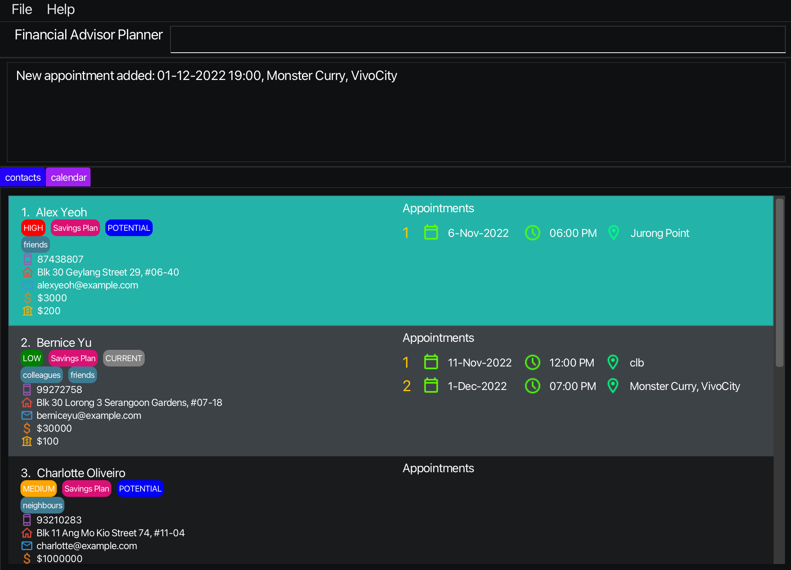
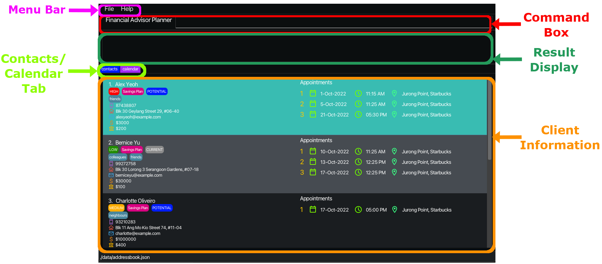
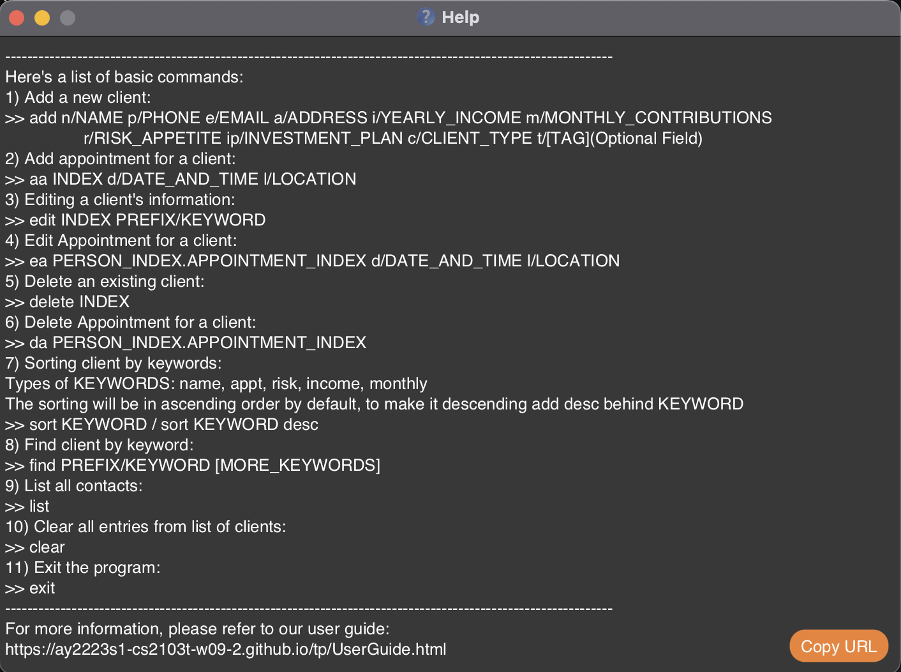
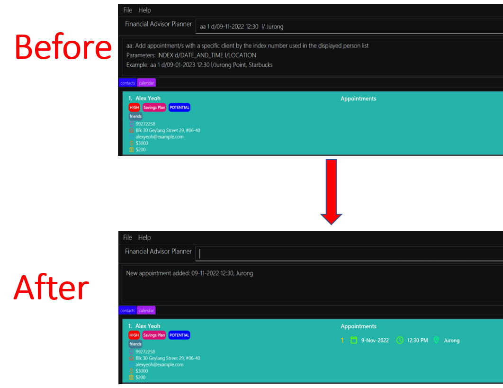
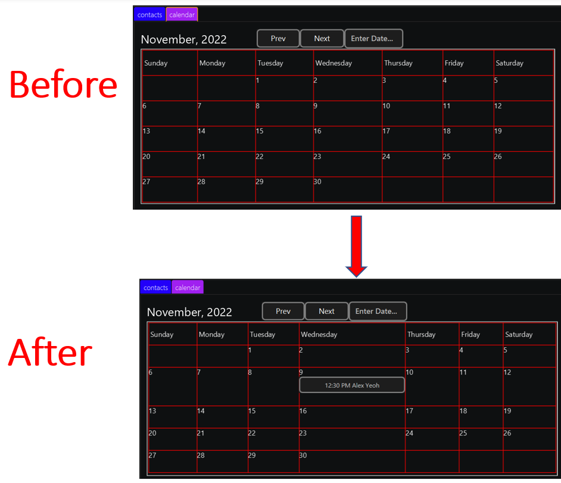
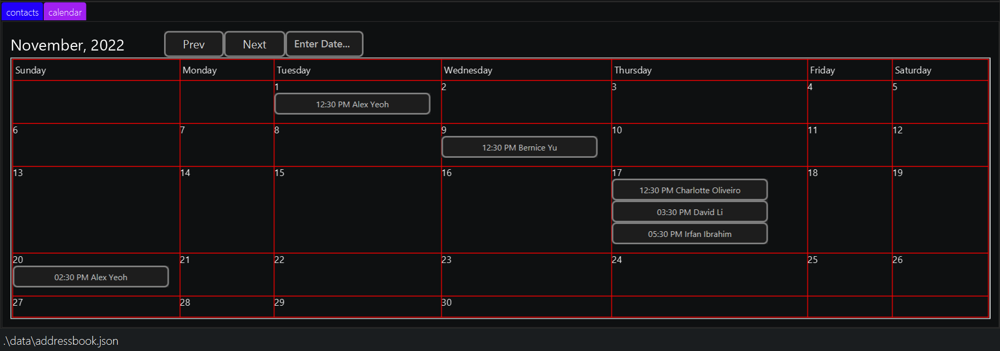
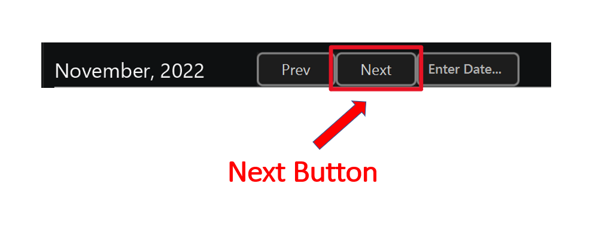
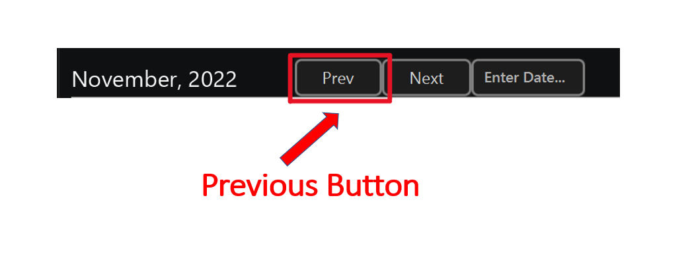
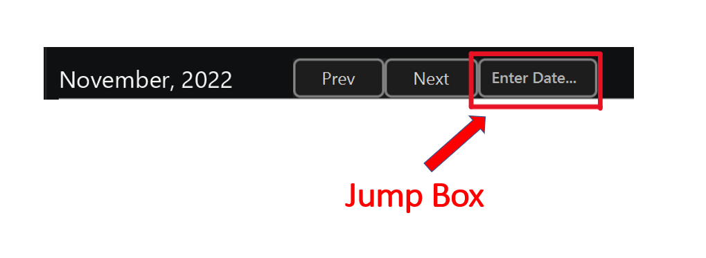
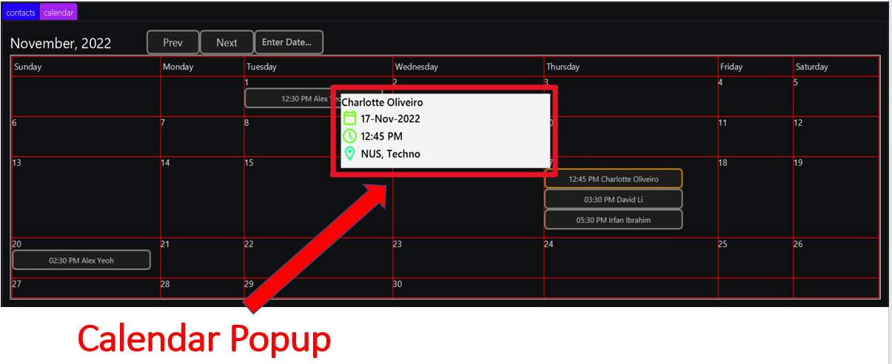

* Table of Contents
{:toc}

--------------------------------------------------------------------------------------------------------------------
## 1. Introduction
Financial Advisor Planner (FAP) is a **desktop app for Financial Advisors (FA) to manage their clients, optimized for use via a Command Line Interface** (CLI) while still having the benefits of a Graphical User Interface (GUI). If you can type fast, FAP can get your client management tasks done faster than traditional GUI apps. With FAP, you can now 

## 2. About

### 2.1 Navigating the User Guide

This section aims to help you navigate the user guide.

1. The next subsection [Section 2.2, Tips for reading the User Guide](#22-tips-for-reading-the-user-guide), provides some tips on reading this document.
2. [Section 3, Quick start](#3-quick-start) has been provided to help you set up **Financial Advisor Planner**.
3. [Section 4, Prefixes](#4-prefixes) has been provided where the prefixes are documented.
4. [Section 5, Features](#5-features) has been provided where the main features and their commands are documented.
5. [Section 8, Glossary](#8-glossary) has been provided where certain terms that are used in this document are defined.

### 2.2 Tips for reading the User Guide

#### 2.2.1 General Symbols and Syntax

Symbol/Syntax        | Meaning
---------------------|------------------
`command`            | indicates commands or keywords related to commands that can be executed by the application.
:bulb:               | indicates that the enclosed text is a tip
:exclamation:        | indicates that the enclosed text is a warning and usually gives details about potential errors.
:information_source: | indicates that the enclosed text are extra notes and information regarding the topic.

## 3. Quick start

1. Ensure you have Java `11` or above installed in your Computer.

2. Download the latest `FAP.jar` from [here](https://github.com/AY2223S1-CS2103T-W09-2/tp/releases).

3. Copy the file to the folder you want to use as the _home folder_ for your FAP.

4. Double-click the file to start the app. The GUI similar to the below should appear in a few seconds. Note how the app contains some sample data. 
   

5. Type the command in the command box and press Enter to execute it. e.g. typing **`help`** and pressing Enter will open the help window. 
   Some example commands you can try:

   * **`list`** : Lists all contacts.

   * **`add`**`n/John Doe p/98765432 e/johnd@example.com a/John street, block 123, #01-01 i/60000 r/LOW m/1000 c/POTENTIAL` : Adds a contact named `John Doe` to the list of clients.

   * **`aa`** `1 d/21-Jan-2023 12:30 PM l/Jurong Point, Starbucks` : Adds an appointment to the client in index 1 of the contact book with the date, time and location of the appointment.

   * **`delete`**`3` : Deletes the 3rd contact shown in the current list.

   * **`clear`** : Deletes all contacts.

   * **`sort KEYWORD`** : Sorts the contacts based on the `KEYWORD`.

   * **`find`** `n/John`: looks for contact that matches keyword ‘John’

   * **`exit`** : Exits the app.

6. Refer to the [Features](#5-features) below for details of each command.

#### 3.1 Graphical User Interface overview

The following figures show the overall GUI of **FAP**

 
 
 

 

            :bulb: **Tip:** Use the `clear` command to delete the sample data when using the application for the first time.

--------------------------------------------------------------------------------------------------------------------
## 4. Prefixes

Prefixes are an indicator for a specific type of parameter to be input during any command. The following section shows the type of prefixes that are used in the app.

Format: `Prefix/Parameter`
1. n/NAME
2. p/PHONE
3. e/EMAIL
4. a/ADDRESS
5. i/YEARLY_INCOME
6. m/MONTHLY_CONTRIBUTIONS
7. c/CLIENT_TYPE
8. r/RISK_APPETITE
9. ip/INVESTMENT_PLAN
10. t/TAG
11. l/Location 
12. d/DATE_AND_TIME

:bulb: **Tip:**
Prefix l/Location is a lower case L, and not an I. 

--------------------------------------------------------------------------------------------------------------------

## 5. Features

This section contains all the information pertaining to the features of **FAP**

**:information_source: Notes about the command format:** 

* Words in `UPPER_CASE` are the parameters to be supplied by the user. 
  e.g. in `add n/NAME`, `NAME` is a parameter which can be used as `add n/John Doe`.

* Items in square brackets are optional. 
  e.g `n/NAME [t/TAG]` can be used as `n/John Doe t/friend` or as `n/John Doe`.

* Items with `…`​ after them can be used multiple times including zero times. 
  e.g. `[t/TAG]…​` can be used as ` ` (i.e. 0 times), `t/friend`, `t/friend t/family` etc.

* Parameters can be in any order. 
  e.g. if the command specifies `n/NAME p/PHONE_NUMBER`, `p/PHONE_NUMBER n/NAME` is also acceptable.

* If a parameter is expected only once in the command but if you specify it multiple times, only the last occurrence of the parameter will be taken. 
  e.g. if you specify `p/12341234 p/56785678`, only `p/56785678` will be taken.

* Extraneous parameters for commands that do not take in parameters (such as `help`, `list`, `exit` and `clear`) will be ignored. 
  e.g. if the command specifies `help 123`, it will be interpreted as `help`.
* Parameter hints will be shown after a command action.

**:warning: Warning regarding the use of the application:** 

Other crucial files will be created and stored in the same folder that contains **FAP.jar**. These files are responsible for storing your data, hence it is advised to not delete or modify these files.

### 5.1 General command features

For more information on the command features, take a look at [Section 6, FAQ](#6-faq).

#### 5.1.1 Viewing help : `help`

Shows a message explaining how to access the help page.

Format: `help`

#### 5.1.2 Adding a client: `add`

Adds a client to the list of clients. 

Format: `add n/NAME p/PHONE e/EMAIL a/ADDRESS i/YEARLY_INCOME m/MONTHLY_CONTRIBUTIONS r/RISK_APPETITE ip/INVESTMENT_PLAN c/CLIENT_TYPE [t/TAG]…​`

* This command is case-sensitive for the parameter NAME.
* After each execution of add command, the displayed contact list resets to the original contact list.

:information_source: **Note:** 
 
RISK_APPETITE can only have the values ‘HIGH’, ‘MEDIUM’ or ‘LOW’
 
 
INVESTMENT_PLAN must end with the word Plan
 
 
CLIENT_TYPE can only have the values ‘POTENTIAL’ or ‘CURRENT’
 
 
Do note that t/TAG is an OPTIONAL TAG, the rest are compulsory. That is to say that a client can have any number of tags, including 0.

Examples:
* `add n/John Doe p/98765432 e/johnd@example.com a/John street, block 123, #01-01 i/$200000 m/$5000 c/POTENTIAL r/Medium ip/Savings Plan`

#### 5.1.3 Listing all clients : `list`

Shows a list of all clients in the client list.

Format: `list`

#### 5.1.4 Editing a client : `edit`

Edits an existing client in the list of clients.

Format: `edit INDEX [n/NAME] [p/PHONE] [e/EMAIL] [a/ADDRESS] [i/YEARLY_INCOME] [m/MONTHLY_CONTRIBUTIONS] [r/RISK_APPETITE] [ip/INVESTMENT PLAN] [c/CLIENT_TYPE] [t/TAG]…​`

* Edits the client at the specified `INDEX`. The index refers to the index number shown in the displayed client list. The index **must be a positive integer** 1, 2, 3,…​
* At least one of the fields must be provided.
* * After each execution of edit command, the displayed contact list resets to the original contact list.
* Existing values will be updated to the input values.
* When editing tags, the existing tags of the client will be removed i.e adding of tags is not cumulative.
* You can remove all the client’s tags by typing `t/` without
    specifying any tags after it.

Examples:
*  `edit 1 p/91234567 e/johndoe@example.com` Edits the phone number and email address of the 1st client to be `91234567` and `johndoe@example.com` respectively.
*  `edit 2 n/Betsy Crower t/` Edits the name of the 2nd client to be `Betsy Crower` and clears all existing tags.

#### 5.1.5 Filtering clients by keyword: `find`

Finds clients whose names contain any of the given keywords.

Format: `find PREFIX KEYWORD [MORE_KEYWORDS]`

Refer to [Prefixes](#4-prefixes) for the types of prefixes.

* The search is case-insensitive. e.g hans will match Hans
* At least one of the parameter fields must be provided.
* The find command finds on the currently displayed contact list.
* The order of the keywords does not matter. e.g. Hans Bo will match Bo Hans
* Only full words will be matched e.g. Han will not match Hans
* Clients matching at least one keyword will be returned (i.e. OR search). e.g. Hans Bo will return Hans Gruber, Bo Yang
* The search also applies to other information available such as mobile number or policy numbers.
  E.g John Doe has the mobile number 87438807
    * find p/87438807 will return John Doe
* The search can be limited to certain categories by using find [CATEGORY] KEYWORD instead.
  * E.g find p/87438807 will return John Doe

Examples:

john - `HIGH`, Alex Yeoh - `HIGH`, David Li - `MEDIUM`, John Doe - `LOW` 

* `find n/ John` returns `john` and `John Doe`
* `find n/ alex david` returns `Alex Yeoh`, `David Li`
* `find r/ high` returns `john` and `Alex Yeoh` 

#### 5.1.6 Deleting a client : `delete`

Deletes the specified client from the list of clients.

Format: `delete INDEX`

* Deletes the client at the specified `INDEX`.
* The index refers to the index number shown in the displayed client list.
* The index **must be a positive integer** 1, 2, 3, …​

Examples:
* `list` followed by `delete 2` deletes the 2nd client in the list of clients.
* `find n/Betsy` followed by `delete 1` deletes the 1st client in the results of the `find` command.

#### 5.1.7 Sorting: `sort KEYWORD`/  `sort KEYWORD desc`

* Sorts the contacts shown in the list of clients by alphabetical order. It is ascending by default.
* You can sort the contacts in descending order by adding `desc` behind the `KEYWORD`.
* The `KEYWORD` is case-insensitive. e.g. sort NaME is the same as sort name. However, do note that the command word sort is case sensitive and must be in lower case.

Format: sort `KEYWORD` / sort `KEYWORD desc`

Types of `KEYWORD`: `name`, `appt`, `risk`, `income`, `monthly`

* Returns all the contacts sorted by the given `KEYWORD`

#### 5.1.8 Clearing all entries : `clear`

Clears all entries from the list of clients.

Format: `clear`

#### 5.1.9 Exiting the program : `exit`

Exits the program.

Format: `exit`
 
### 5.2 Appointment command features

#### 5.2.1 Adding an appointment : `aa`

Adds an appointment with inputs DATE_AND_TIME and LOCATION for an existing client in the list of clients. This will also update the Calendar and the appointment will be shown in the matching month in the Calendar.

Format: `aa INDEX d/DATE_AND_TIME l/LOCATION`

Example: `aa 1 d/21-Jan-2023 12:30 PM l/Jurong Point, Starbucks`

The appointment details will be added to the specified client's information.

 
Also, the appointment details will be added to the calendar.

:bulb: **Tip:**
 
* DATE_AND_TIME has the format `d-MMM-yyyy hh:mm a` 
* The PM/AM in TIME is case-sensitive, and whitespace sensitive as well.

:information_source: **Note:** Input DATE_AND_TIME must be valid in order for the command to be executed.
 
* Each client can have a maximum of 3 appointments, and there cannot be appointments with the same DATE_AND_TIME in the overall list of appointments.
* We allow the adding of appointments that are in the past, this is similar to any calendar apps where you can add events to dates that are in the past.

Examples:

* `aa 1 d/21-Jan-2023 12:30 PM l/Jurong Point, Starbucks`

#### 5.2.2 Editing an appointment : `ea`
Edits an appointment for an existing client in the list of clients. This will also update the Calendar and the appointment will be shown in the matching month in the Calendar.

Format: `ea PERSON_INDEX.APPOINTMENT_INDEX [d/DATE_AND_TIME] [l/LOCATION]`
* Edits the client's appointment using specified PERSON_INDEX and APPOINTMENT_INDEX.
* The PERSON_INDEX refers to the index number shown in the displayed client list. The index must be a positive integer 1, 2, 3,…​
* The APPOINTMENT_INDEX refers to the index number shown in the displayed client's appointment list. The index can only be 1, 2, or 3.
* At least one of the optional fields must be provided.
* Existing values will be updated to the input values.

Examples:

* `ea 1.1 d/21-Jan-2023 12:30 PM l/West Mall, Starbucks` Edits both the date and location of the 1st client's 1st appointment to be `21-Jan-2023 12:30 PM` and `West Mall, Starbucks` respectively.
* `ea 2.3 l/NUS, TechnoEdge` Edits the location of the 2nd client's 3rd appointment to be `NUS, TechnoEdge`

#### 5.2.3 Deleting an appointment : `da`
Deletes an appointment for an existing client in the list of clients. This will also update the Calendar and the appointment will be shown in the matching month in the Calendar.

Format: `da PERSON_INDEX.APPOINTMENT_INDEX`
* Deletes the client's appointment using specified PERSON_INDEX and APPOINTMENT_INDEX.
* The PERSON_INDEX refers to the index number shown in the displayed client list. The index must be a positive integer 1, 2, 3,…​
* The APPOINTMENT_INDEX refers to the index number shown in the displayed client's appointment list. The index can only be 1, 2, or 3.

Examples:

* `da 1.1` Deletes the 1st client's 1st appointment

### 5.3 Calendar features

**:information_source: Notes about the switching between Contacts and Calendar Tabs:**
 
* `CTRL + 1` keys will switch the current tab to the Contacts tab
* `CTRL + 2` keys will switch the current tab to the Calendar tab

#### 5.3.1 Calendar Display
Displays a calendar format for the current month which shows all the appointments separated into their matching dates for that month. The appointments that are displayed for each day are also sorted in ascending order, which follows the time convention.

The following figure shows an empty Calendar Display:

The Calendar Display can be filled by adding appointments. [View Section 4.2.1 for information on how to add appointments](#421-adding-an-appointment--aa)

The following figure shows the Calendar Display with several appointments:

#### 5.3.2 Calendar Navigation
There are 3 ways to ease navigation between months that are displayed.

##### 5.3.2.1 Next Button
Clicking the Next button or pressing the "N" key will display the next month.
Examples:

##### 5.3.2.2 Prev Button
Clicking the Prev button or pressing the "B" key will display the previous month.
Examples:

##### 5.3.2.1 Jump Box
Typing in the desired date in the provided text field followed by pressing the "ENTER" key will show the given calendar of the month and year.
Format: DATE
Examples: `1-Oct-2022`

#### 5.3.3 Calendar Pop-ups
Displays more detailed information of the selected appointment on the calendar which includes the name of the client, date, time and location of the scheduled appointment.

There are 3 ways to activate the Calendar Popup:
1. Clicking on the client's appointment button.
2. Pressing TAB/SHIFT + TAB key within the Calendar View to focus on the desired client's appointment button.
3. Pressing UP/DOWN/LEFT/RIGHT key within the Calendar View to focus on the desired client's appointment button.

The following figure shows the Calendar Popup being activated within the Calendar View:

### 5.4 Command Line tools
#### 5.4.1 Parameter hints
After typing in the command word, the command's parameters and their respective prefixes are shown. An example of a valid command will also be shown.

#### 5.4.2 Command history
Use the up and down keys to navigate through previously typed commands. Users can edit the command first or press enter to execute the command. 
* Only valid commands will be saved in the command history
* Command history will only save up to 20 previously typed valid commands
* Consecutive duplicate commands will not be saved (e.g entering "list" 3 times in a row will only add "list" to command history once)

### 5.5 Miscellaneous commands

#### 5.5.1 Saving the data

FAP data are saved in the hard disk automatically after any command that changes the data. There is no need to save manually.

#### 5.5.2 Editing the data file

FAP data are saved as a JSON file `[JAR file location]/data/FAP.json`. Advanced users are welcome to update data directly by editing that data file.

:exclamation: **Caution:**
If your changes to the data file makes its format invalid, FAP will discard all data and start with an empty data file at the next run.

### 5.6 Future features

#### 5.6.1 Archiving data files `[coming in v2.0]`

_Details coming soon ..._

--------------------------------------------------------------------------------------------------------------------

## 6. FAQ

**Q**: How do I transfer my data to another Computer? 
**A**: Install the app in the other computer and overwrite the empty data file it creates with the file that contains the data of your previous FAP home folder. 
**Q**: Why do you allow duplicate email and phone number in your add command, given that there won't be two people with the same email or number? 
**A**: Currently we only have duplicate checks for name. We will implement duplicate checks for email and phone number in the future. 
**Q**: Why can't I add appointments even though I typed the date_time correctly? 
**A**: Check that you have typed the date_time in the correct case with the correct spacing. We apologise for the strict requirement and we promise we are working on relaxing the requirements! 

--------------------------------------------------------------------------------------------------------------------

## 7. Command summary

Action | Format, Examples
--------|------------------
**Add client** | `add n/NAME p/PHONE_NUMBER e/EMAIL a/ADDRESS i/YEARLY_INCOME r/RISK_APPETITE m/MONTHLY_CONTRIBUTIONS c/CLIENT_TYPE [t/TAG]…​ `   e.g., `add n/James Ho p/22224444 e/jamesho@example.com a/123, Clementi Rd, 1234665 i/60000 r/Low s/1000 t/friend t/colleague`
**Add Appointment** | `aa INDEX d/DATE_AND_TIME l/LOCATION`   e.g., `aa 1 d/21-Jan-2023 12:30 PM l/Jurong Point, Starbucks`
**Edit Appointment** | `ea PERSON_INDEX.APPOINTMENT_INDEX [d/DATE_AND_TIME] [l/LOCATION]`   e.g., `ea 1.2 d/21-Jan-2023 12:30 PM l/NUS, TechnoEdge`
**Delete Appointment** | `da PERSON_INDEX.APPOINTMENT_INDEX`   e.g, `da 1.2`
**Clear** | `clear`
**Delete** | `delete INDEX`  e.g., `delete 3`
**Edit** | `edit INDEX [n/NAME] [p/PHONE_NUMBER] [e/EMAIL] [a/ADDRESS] [i/YEARLY_INCOME] [r/RISK_APPETITE] [m/MONTHLY_CONTRIBUTIONS] [c/CLIENT_TYPE] [t/TAG]…​`  e.g.,`edit 2 n/James Lee e/jameslee@example.com`
**Exit** | `exit`
**Find** | `find PREFIX/KEYWORD [MORE_KEYWORDS]` e.g., `find n/James Jake`
**List** | `list`
**Help** | `help`
**Sort** | `sort KEYWORD, sort KEYWORD desc` 

## 8. Glossary

Term | Meaning 
--------|------------------
**Command Line Interface (CLI)** | A CLI is a text-based user interface that allows users to input commands in the form of text.
**Graphical User Interface (GUI)** | A GUI is a graphics-based user interface that allows users to interact with elements such as icons and buttons when running a program.
**Command** | An instruction given by the user that is to be executed. 
**Parameter** | Variables that have been typed by the user that is to be provided to the command to be executed.
**Prefix** | Indicator for a specific parameter to be input during the command. Prefixes end with a slash (/)
